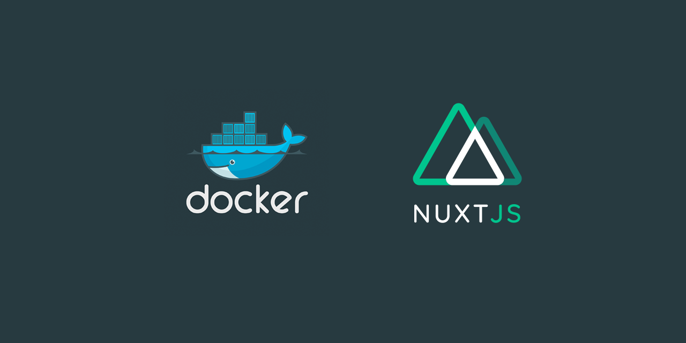

A simple docker starter template to run nuxt in a container which is available via `localhost:8080`. 

©️ This repository is the same as [laravel-nuxt-docker](https://github.com/nevadskiy/laravel-nuxt-docker) but without laravel. So credits to the team behind it. 

## 🖍️ Why

My primary use of the container version is to run integration tests against it.

Here you can find my [nuxt-playwright-template](https://github.com/regenrek/nuxt-playwright-template) repository, which includes some tests which you can run against this server.

## 🚀 Features

* Nuxt.js
* Nginx (Access site via `localhost:8080`)

## 📦 Install

```
git clone git@github.com:regenrek/nuxt-docker.git
cd nuxt-docker
```

```
make install
```

## Reinstall

If you want to reinstall Nuxt from scratch with a fresh version, use the following command

❗ **Attention** This will delete your current nuxt project in `client/` directory 

```bash
make reinstall-nuxt
```

[More Info](https://github.com/nevadskiy/laravel-nuxt-docker#reinstallation-frameworks)

## License

[MIT License](./LICENSE)